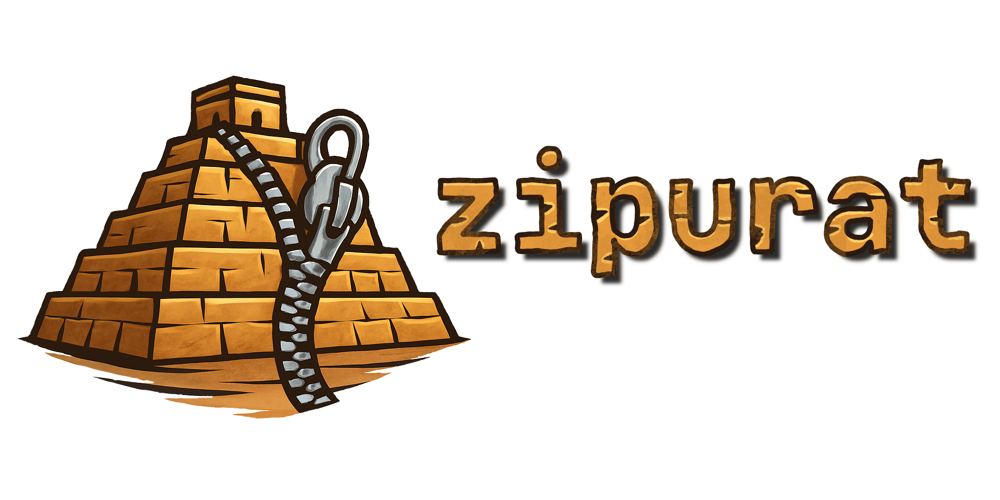

<div align="center">

  </div>

This repo contains a description of the `.zprt` archive format and a cli tool
for interacting with it.

## Why does this exist?

We all have that archive from when we stopped using a cloud service or made a
last backup from an old laptop. The files are there, probably more than once,
but how do we use them? Usually the only way to get to a file is to copy the
entire archive from wherever it is stored, decrypt and decompress it in its
entirety, and then search for what we want.

Some backup tools fare a lot better in this regard, but they have their own
shortcomings:

- They are usually a lot more complex because they are designed to facilitate
  the entire backup process. That means that their underlying storage format can
  be very complicated.
- They are often not very _programmer friendly_. Ideally, we want to be able to
  easily access old files in scripts.

Zipurat optimizes for fast random file access over sftp or from a slow
filesystem.

## The goals

- Very fast indexing and single file access
- Optimized for access over sftp
- Sensible encryption (Some information can leak, but not the contents of
  files.)
- Simple and well described format (It should be possible to get your data
  without this repo.)
- Small files (thanks to deduplication and compression)

## The non-goals

This is not a solution for creating backups, but for when you already have
backups and want to organize them differently. This is not meant to deal with
datasets that are still evolving. Therefore, creating the archive is allowed to
be slow and inconvenient because you will only do it once.

There is no support for anything but file contents: no metadata, no links. The
only exception are empty directories.

There is no error correction used inside the format. Any damage to the file will
lead to (at least partial) data loss.

## Security notice

> [!WARNING] Do not use this if your personal safety depends on the encryption
> being secure!

The first thing to note is that the number of files as well as their approximate
sizes are not obfuscated. Even without decrypting the data it is be possible to
guess at their nature. It might also be possible to deduce with relative
certainty that an archive contains a certain dataset.

The second point is that this implementation relies on an
[implementation](https://crates.io/crates/age) of age to be secure.

## Getting started

### Installation

This tool can be installed using cargo:

```sh
cargo install --git https://github.com/JanNeuendorf/zipurat
```

### Creating an archive

Prepare the folder by unpacking all existing archives within it. You will also
have to resolve all file links and other objects that are not files.

The next step is to acquire an age identity-file if you do not already have one.
This can be done by installing age and running `age-keygen`. For decryption,
zipurat will search in `~/.config/age/` (or equivalent) if no file is provided.
But when we create an archive, we need to specify the file.

We then use the `create` subcommand to create the archive.

```
Usage: zipurat <ARCHIVE> create [OPTIONS] --source <SOURCE>
Arguments:
  <ARCHIVE>
          The archive to interact with (can be sftp://...)
Options:
  -s, --source <SOURCE>                        The directory to be archived
  -c, --compression-level <COMPRESSION_LEVEL>  The zstd compression level [default: 3]
```

### Interacting with the archive

There are a number of subcommands to interact with the archive:

```
Commands:
  create   Create an archive
  show     Show the contents of a single file
  list     List a directory
  restore  Restore a file or directory from the archive
  du       Get the (uncompressed) size
  info     Get archive information
```

## The design

The Idea is very simple, all files are compressed and encrypted individually and
and an index is stored at the end. The index is compressed and encryptet too. It
is relatively small to minimize the cost of reading it.

### The format

zipurat uses its own binary format. It is, however really easy to understand. It
is just a wrapper around age and zstd with a custom file index.

It is detailed in ...todo!

## The name

zipurat=zip+ziggurat (a once impressive building that is now a pile of stone to
rummage through).
